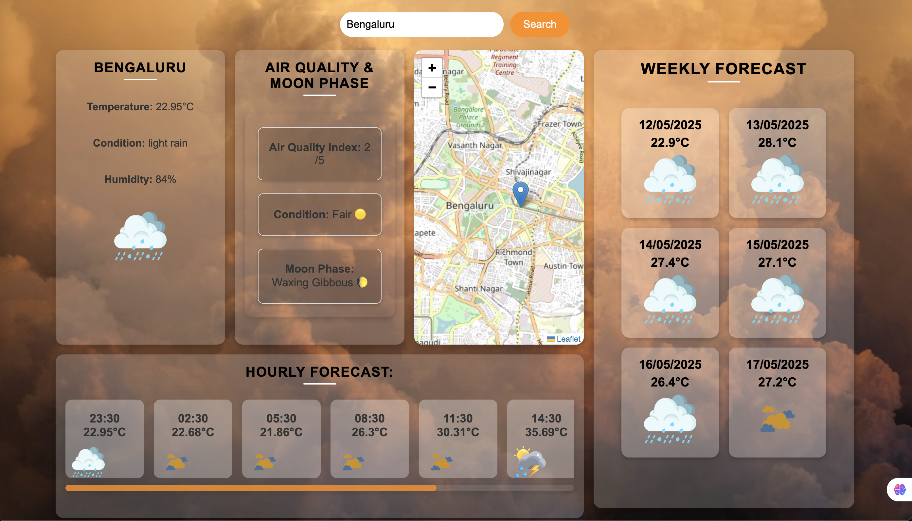

# 🌤️ Weather App



## A responsive and interactive Weather App built using HTML, CSS, and JavaScript that displays current weather, air quality, moon phase, hourly and weekly forecasts, and integrates a dynamic map using Leaflet.

---

## 🚀 Features

- 🔍 **City Search**: Enter any city name to get the current weather.
- 📍 **Current Location**: Automatically fetch weather using your geolocation.
- 🌡️ **Current Weather**: Displays temperature, weather condition, humidity, and icon.
- 🌬️ **Air Quality Index (AQI)**: Indicates the air quality (1-5 scale) and provides a health description.
- 🌕 **Moon Phase**: Calculates and shows the current moon phase.
- 🕒 **Hourly Forecast**: Shows temperature and condition for the next 8 hours.
- 📅 **Weekly Forecast**: Averages daily temperature and shows conditions for 7 days.
- 🗺️ **Map Integration**: Dynamic map with marker using Leaflet and OpenStreetMap.

---

## 🧑‍💻 Tech Stack

- **Frontend**: HTML, CSS, JavaScript
- **API**: OpenWeatherMap API
- **Map**: Leaflet.js

---

## 🔧 Setup Instructions

1. Clone the repository:
    ```bash
    git clone https://github.com/your-username/weather-app.git
    cd weather-app
    ```

2. Install dependencies:
    - No backend dependencies required — pure frontend app.

3. Set up your API key:
    - Replace the placeholder in `script.js` with your OpenWeatherMap API key:
    ```javascript
    const API_KEY = 'YOUR_API_KEY_HERE';
    ```

4. Add Weather Icons:
    - Make sure the following icon files exist under a folder named `icons/`:

---

❤️‍🔥 Live Website Links: [Check out the live app here!](https://weather-app-seven-navy-94.vercel.app/)
